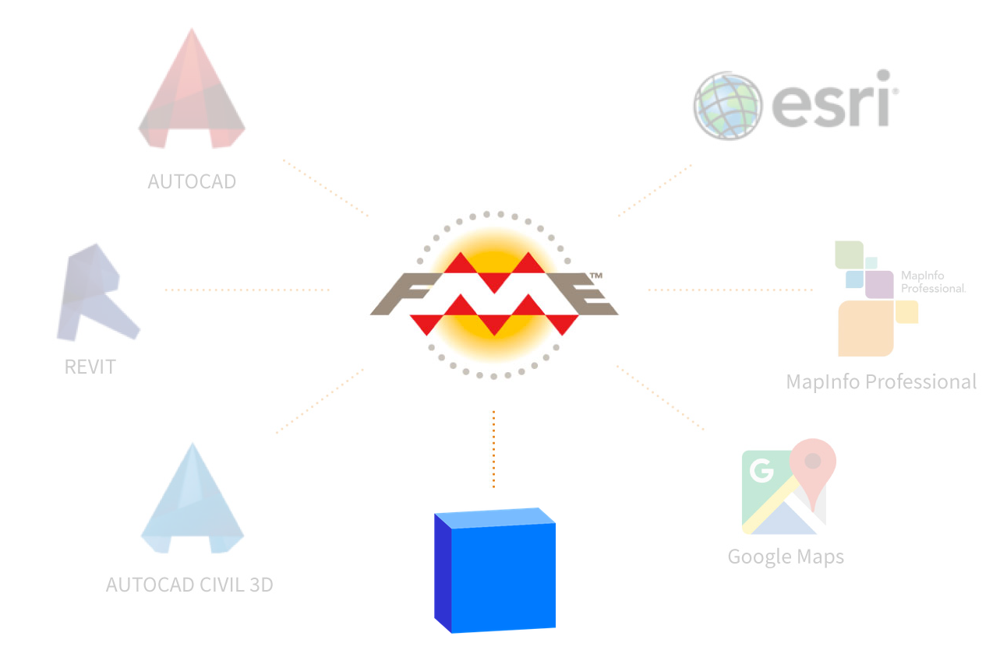

<h1 align="center">
   
  Speckle | FME
</h1>
<h3 align="center">
    Connector for Spatial Data to and from FME
</h3>

A custom reader/writer for FME to connect and query a Speckle Server. As this is all being developed for an alpha release, the description of any steps here or any features that may emerge are in total flux.

## What is Speckle?

Speckle is an open source software platform that helps you get in control of your own data.
Speckle stores your 3D models and BIM data directly inside a database in a transparent and accessible way.

## What is FME?

The Feature Manipulation Engine (FME) is a platform that streamlines the translation and analysis of spatial data between geometric and digital formats. It is intended especially for use with geographic information system (GIS), computer-aided design (CAD) and raster graphics software. It can augment any dataset with information from another.

## Repo Structure

This repo contains the FME Connectors for Speckle 2.0. It is written in `python` and uses the [Speckle Python SDK](https://github.com/specklesystems/speckle-py) and the [FME Python SDK](http://docs.safe.com/fme/html/fmepython/).

The python code used within the connectors is developed external to FME PythonCaller transformer for ease of maintenance and testing. The published connectors embed the scripts, wrap these callers into Custom Transformers that allow for handling of input and output parameters – all of which are a arranged with a somewhat unique paradigm to FME relative to other visual scripting platforms.

There is no current plan to describe how FME works within this repo.
## Roadmap

**What can it do?**

FME doesn't straightforwardly allow for additional UI elements, so the first target is the publication of a series of custom FME Trasnformers that mimic the Grasshopper tools' interactions.

These implementations will be Transformer based rather than directly into a Reader/Writer package. This is to allow the requirements to settle before freezing and working on a UI.

Key to the FME connection to Speckle will be to maximise the usefulness of the FME part of the workflow by maximising the genericity of Features as they are read without a strong view of how this will impact on writing future re-use. i.e. Speckle > FME > Speckle prioritised over onward connections.

**what is different**

In addition to the UI difference to other visual node programming examples like Sverchok/Blender, Grasshopper or Dynamo, FME also handles data and data flow in a quite different manner.

FME can handle many different datatypes, but all are held as properties within "features". In FME everything is a Feature (consider a row in a table) and no data is not in a feature*.

As such the wiring and consecutive blending of datatypes is fundamentally different. In Grasshopper a Node can have separate entry points for strings, numbers, boolean flags and geometry, etc. In FME, transformers we handle features. In the OOTB python callers, there is a single point of entry for a stream of features. The transformation may have logic within it that is selective but in essence every transformer acts on every feature in the stream.

For specke-fme, this is worked around by building custom tranformers which are in fact packaged mini workbooks that allow the parent transformer to have, say, a speckle-client feature in one port, a list of stream features in another and the complexity of blending these two squirreled away inside. What FME cannot do is pass a Client "object" to another transformer only the transformed results from another.

* *There are global variables for some simple datatypes. These are immutable once the workflow is instantiated.

## Getting Started

### Installation

**Invoking PIP install of Speckle for FME**

*macOS*

`fme python -m pip install specklepy --target ~/Library/Application\ Support/FME/Plugins/Python`

`fme python -m pip install requests --target '/Library/FME/<version:yyyy.x>/python'Python`
`fme python -m pip install urllib3 --target '/Library/FME/<version:yyyy.x>/python'`

…
